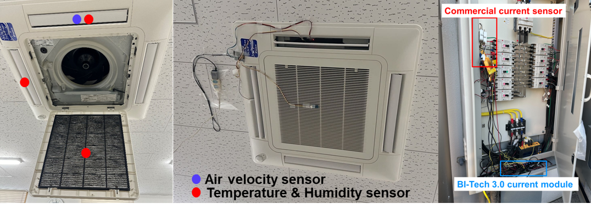
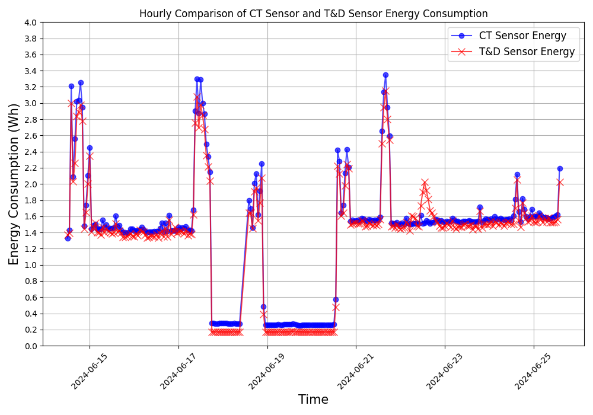
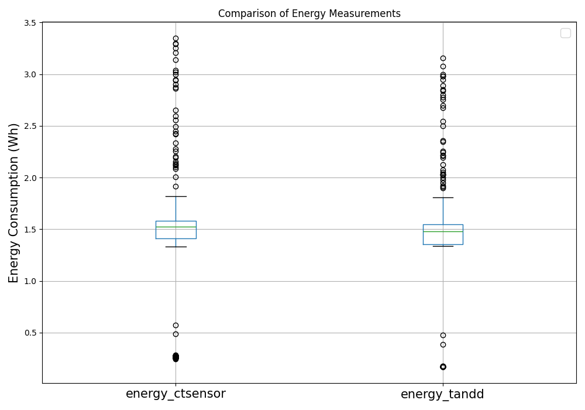

# Realtime HVAC system performace ckeck kit
This is a IoT based BI-Tech platform for check Coefficient of Performance (COP) real-time in VRF system. 

## Introduction
This platform consists of 3 parts: 
- Offline Training.
- Cloud compution.
- Apllication.

## Hardware
- Power monitor part
- Indoor outlet part

## Algorthm--Coefficient of Performance (COP) Calculation

### Input: 
- T_in, RH_in \
 Return air temperature and relative humidity
- T_out1, T_out2, RH_out1, RH_out2 \
 Supply air temperatures and relative humidities for two outlets
- v \
Airflow speed
P_total // Total power consumption

### Output: 
- COP // Coefficient of Performance
-   Q_cooling // Cooling capacity

### Steps:
1: h_in ← CalculateEnthalpy(T_in, RH_in) // Calculate return air enthalpy\
2: h_out1 ← CalculateEnthalpy(T_out1, RH_out1) // Calculate supply air enthalpy for first outlet\
3: h_out2 ← CalculateEnthalpy(T_out2, RH_out2) // Calculate supply air enthalpy for second outlet\
4: h_out_avg ← (h_out1 + h_out2) / 2 // Calculate average supply air enthalpy\
5: Q_cooling ← (n * rho * v * (h_in - h_out_avg)) / 3.6 // Calculate cooling capacity, 3.6 converts kJ/s to kW\
6: COP ← Q_cooling / (P_total / 1000) // Calculate COP, converting power from watts to kilowatts\
7: Validate COP // Check if COP < 0 or COP > 10, mark as potential outlier

## Comparing experiment with commerical power monitor
For ensuring the energy consumption result measruing by proposed IoT kit, we conducted a compare experiment with commerical power monitore (T&D clamp sensor). The result shows the 5% difference for 10 days experiment.

    
    

## Reference
For more detailed information, please refer to the following paper:
- __Yutong CHEN__,
[An IoT-Based Interactive Diagnostic System for HVAC Performance in Office Buildings](https://publications.ibpsa.org/asim-conference-proceedings/), ASim 2024 (The 5th Asia Conference of International Building
Performance Simulation Association).
