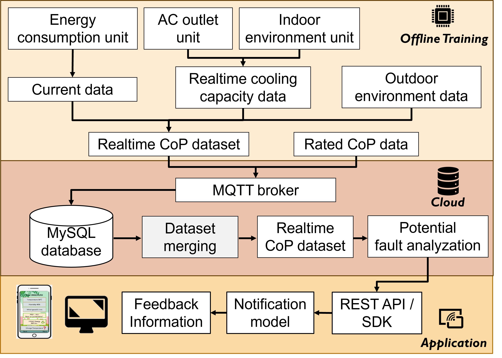

# IoT-based-HVAC-system-performace-relatime-ckeck-kit
This is a new method for check Coefficient of Performance in VRF system 
## Introduction
We proposed an IoT platform for checking real-time performance of HVAC system.

## Algorthm--Coefficient of Performance (COP) Calculation

### Input: 
- T_in, RH_in \
 Return air temperature and relative humidity
- T_out1, T_out2, RH_out1, RH_out2 \
 Supply air temperatures and relative humidities for two outlets
- v \
Airflow speed
P_total // Total power consumption

### Output: 
- COP // Coefficient of Performance
-   Q_cooling // Cooling capacity

### Steps:
1: h_in ← CalculateEnthalpy(T_in, RH_in) // Calculate return air enthalpy\
2: h_out1 ← CalculateEnthalpy(T_out1, RH_out1) // Calculate supply air enthalpy for first outlet\
3: h_out2 ← CalculateEnthalpy(T_out2, RH_out2) // Calculate supply air enthalpy for second outlet\
4: h_out_avg ← (h_out1 + h_out2) / 2 // Calculate average supply air enthalpy\
5: Q_cooling ← (n * rho * v * (h_in - h_out_avg)) / 3.6 // Calculate cooling capacity, 3.6 converts kJ/s to kW\
6: COP ← Q_cooling / (P_total / 1000) // Calculate COP, converting power from watts to kilowatts\
7: Validate COP // Check if COP < 0 or COP > 10, mark as potential outlier\

