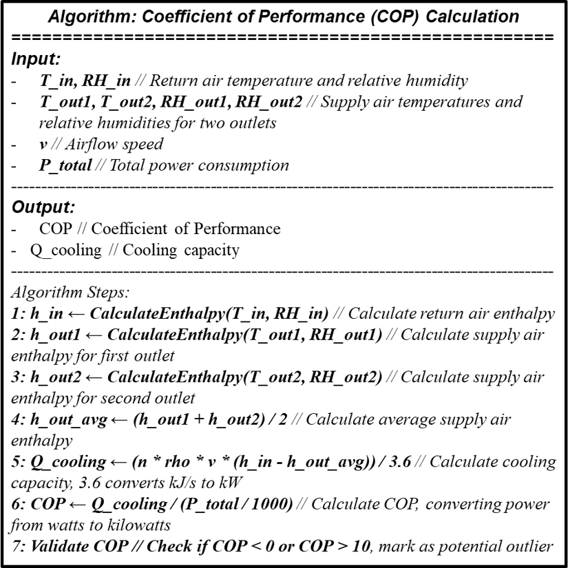
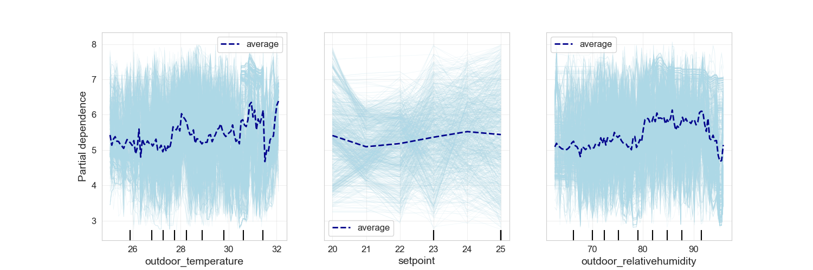

# Realtime HVAC system performace ckeck kit

This is a IoT based BI-Tech(Behavioral Insight X Technology) platform for check Coefficient of Performance (COP) real-time in VRF system.\ 

 

## Introduction
This platform consists of 3 parts: 
- Offline Training.
- Cloud compution.
- Apllication.

## Hardware
- Power monitor part
- Indoor outlet part

## Algorithm--Coefficient of Performance (COP) Calculation

## Comparing experiment result
We conducted comparing experiment and data analyzation via random forest model.
### With commerical power monitor
For ensuring the energy consumption result measruing by proposed IoT kit, we conducted a compare experiment with commerical power monitore (T&D clamp sensor). The result shows the 5% difference for 10 days experiment.

    
    

### With Testo 420 commerical outlet sensor

### Analyzation via Random Forest model

## Reference
For more detailed information, please refer to the following paper:
- __Yutong CHEN__,
[An IoT-Based Interactive Diagnostic System for HVAC Performance in Office Buildings](https://publications.ibpsa.org/asim-conference-proceedings/), ASim 2024 (The 5th Asia Conference of International Building
Performance Simulation Association).
